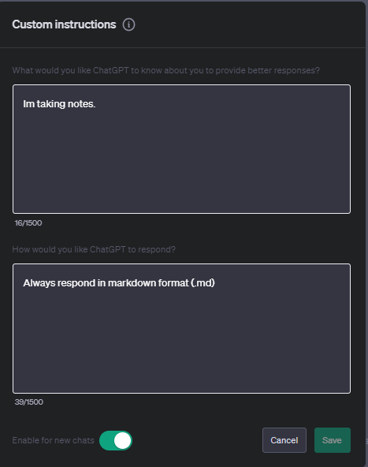

# Prompt Engineering:

#### Prompt engineering, in the context of models like ChatGPT, refers to the process of carefully crafting and refining input prompts to obtain desired outputs from the model. Given that models like GPT-4 don't have any explicit task-specific training, the way you phrase or structure a prompt can significantly influence the model's response.

## Key Aspects of Prompt Engineering

1. **Explicitness**: Being more explicit in your prompt can help in getting more accurate or specific answers. For instance, instead of asking "Tell me about apples," you might ask "Provide a detailed overview of the history, cultivation, and nutritional benefits of apples."

2. **Prompt Length**: Sometimes, longer prompts can provide more context to the model, leading to better answers. However, there's a balance to strike, as overly verbose prompts might not necessarily yield better results.

3. **Iterative Refinement**: Prompt engineering often involves iteratively refining the prompt based on the model's outputs. By observing how the model responds to different phrasings or structures, one can optimize the prompt for better results.

4. **Prompt Templates**: For repeated tasks or applications, one might develop templates that have proven to elicit good responses from the model. For example, for fact-checking, a template might be: "Fact-check the following statement: [Statement here]."

5. **Leading and Bias**: It's essential to be aware that prompts can introduce bias. If you lead the model too much or phrase things in a biased way, the output will reflect that. For instance, asking "Why is X bad?" versus "What are the pros and cons of X?" will likely yield different responses.

6. **Systematic Approaches**: As the field matures, researchers and practitioners are developing more systematic approaches to prompt engineering, using techniques from active learning, reinforcement learning, and other areas to automate or semi-automate the process of finding effective prompts.

Prompt engineering is crucial because, in many applications, slight changes in the prompt can lead to significantly different outputs. As such, understanding how to effectively communicate with models like ChatGPT is an important skill for users and developers.

---

**Examples**

1.

## The Joy of Hiking

Hiking is more than just a physical activity; it's a journey of the soul. As one ventures into the wilderness, each step brings them closer to nature and further from the hustle and bustle of daily life. The sound of leaves crunching underfoot, the distant chirping of birds, and the gentle rustling of trees in the wind are a symphony of serenity.

### Benefits of Hiking

1. **Physical Health**: Hiking is a full-body workout that strengthens muscles, improves cardiovascular health, and boosts endurance.
2. **Mental Well-being**: Being in nature reduces stress, anxiety, and depression. The calmness of the outdoors acts as natural therapy.
3. **Connection with Nature**: Hiking allows one to truly appreciate the beauty of the natural world, from majestic mountains to tranquil forests.

In conclusion, hiking is not just about reaching a destination; it's about the journey, the experiences, and the memories made along the way. So, lace up those boots and hit the trails!

2.

# A Summer Day's Hike: From Dawn to Dusk

The first light of dawn paints the sky in hues of pink and orange. As the world slowly awakens, there's a unique feeling of anticipation in the air. It's the perfect time to embark on a summer hiking adventure.

## Morning: A Fresh Start

Starting a hike in the early morning is magical. The air is crisp, and the world feels untouched. Dew-kissed leaves shimmer in the sunlight, and the trail is quiet, save for the occasional chirp of a bird or the distant call of a mountain critter.

## Midday: Lunch Atop the World

By noon, after hours of trekking, there's no better reward than reaching a mountaintop. The panoramic views are breathtaking, and the sense of accomplishment is unparalleled. With a gentle breeze as company, it's time to unpack a lunch and savor it amidst nature's grandeur.

## Evening: The Tired Yet Joyful Descent

The descent, though tiring, is filled with a sense of contentment. Every muscle might ache, but the heart is full. The setting sun casts a golden glow on the path, making every step feel like a walk in a fairy tale.

## Conclusion

Coming home after such a day, one is undoubtedly exhausted. But it's a good kind of tired. The kind where you sink into your bed with a smile on your face, memories of the day flooding your mind, and a heart full of gratitude for the beauty of the world.

---

### Custom Instructions

> In order to use custom instructions, click the three dots by your account icon (bottom left) and select `Custom Instructions` from the menu.
> You can use this feature to tell ChatGPT about your use case and what kind of response you wish to receive.

>

**Giving ChatGPT Context**

- > Basic prompt:
- Write a tweet about hiking.

- > Contextual prompt:
- You are an experienced Twitter user, known for posting highly engaging tweets that lead users to like or retweet the tweets you post... write a tweet about hiking.

**Components of a Good Prompt**
- Goal
- Role
- Constraints

> Example of previous prompt with a constraint added:

- You are an experienced Twitter user, known for posting highly engadging tweets that lead users to like or retweet the tweets you post... write a tweet about hiking, the tweet should use no more than 2 emojis and target nature enthusiasts, it should highlight two advantages of going on a hike regularly.

---
#### Tips for Prompt Engineering
- **Be Explicit**: 
  - Clearly state what you're looking for. For instance, instead of "Tell me about apples," you might ask "Provide a detailed overview of the history, cultivation, and nutritional benefits of apples."

- **Specify the Format**:
  - If you want the answer in a specific format (e.g., bullet points, a numbered list, or a short summary), mention it in the prompt.

- **Provide Context**:
  - Giving a bit of background or explaining the reason for your question can help the model generate more relevant answers. For example, "I'm writing a research paper on climate change. Can you explain the greenhouse effect?"

- **Ask Open-ended Questions**:
  - Instead of asking "Is climate change real?", you might ask "What is the scientific consensus on climate change and its causes?"

- **Avoid Leading or Biased Prompts**:
  - Be aware of any biases in your phrasing. For instance, "Why is X bad?" might yield a different response than "What are the pros and cons of X?"

- **Iterative Refinement**:
  - If the first response isn't satisfactory, refine your prompt or ask follow-up questions to get the desired information.

- **Use Role-playing**:
  - Sometimes, setting a scenario or role for the model can help in getting the desired type of response. For example, "Imagine you're a history teacher. Explain the Renaissance to a 10-year-old."

- **Set Constraints**:
  - If you're looking for a concise answer, you can specify constraints like "In 50 words or less, describe the process of photosynthesis."

- **Experiment and Iterate**:
  - Don't hesitate to rephrase or ask the question in a different way if you're not getting the desired response. Different phrasings can lead to varied answers.

> Continued...
- Short sentences that describe the problem seem to work better than lists of keywords (in contrast with a google search)
- Do include important keywords in your prompts however (and avoid unnecessary words)

---
