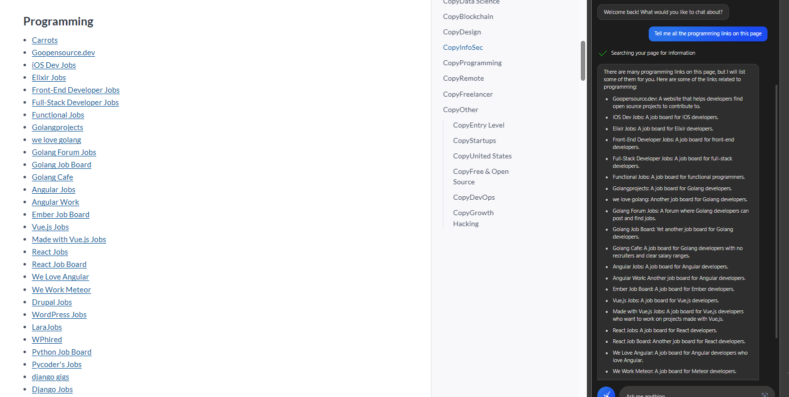
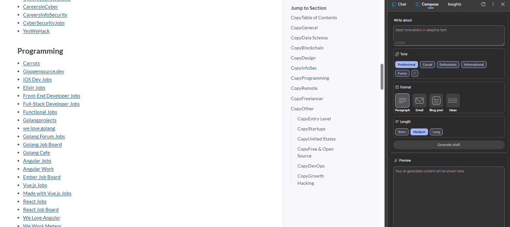
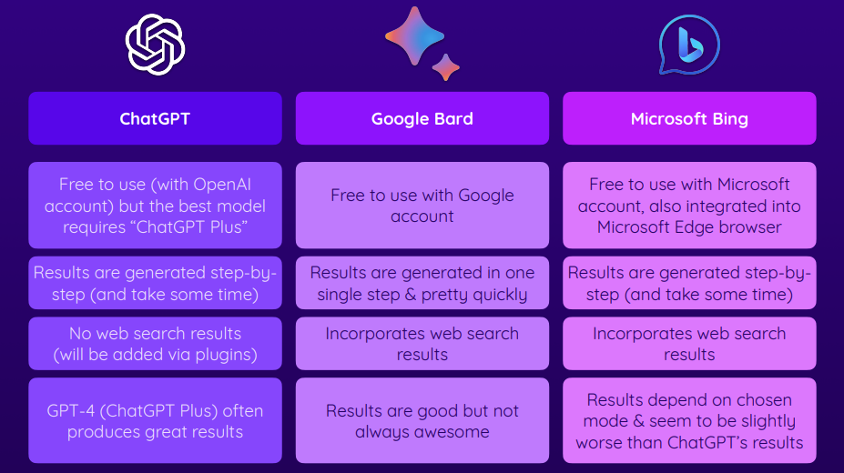

# AI Chat-GPT & LLM's

> Command to create table of contents: `find . -name "*.md" -type f | sed 's/^\.\///' | sed 's/\.md$//' | awk -F/ '{print "- [" $NF "](./" $0 ".md)"}' > links.md`

### [Table of Contents](./links.md)

### (Chat Generative Pre-trained Transformer) and Large Language Models (LLMs) like GPT-3 are a type of artificial intelligence model designed for natural language processing. Here's a summary of how they work:

#### [Link To Chat](https://chat.openai.com/)

1. Pre-training:

- These models are pre-trained on vast amounts of text data from the internet. During this phase, they learn to predict the next word in a sentence by analyzing the context of the previous words. This process helps them develop an understanding of grammar, syntax, and some level of world knowledge.

2. Transformer Architecture:

- Both Chat-GPT and LLMs are built on the Transformer architecture, which is a deep neural network model. The Transformer architecture is designed to handle sequential data, making it well-suited for natural language understanding and generation tasks.

3. Tokenization:

- Text is divided into smaller units called tokens, which can be words, subwords, or characters. These models tokenize input text, allowing them to process and generate text in discrete chunks.

4. Attention Mechanism:

- Transformers use attention mechanisms to weigh the importance of different tokens in a sequence. This helps capture long-range dependencies and relationships between words.

5. Fine-tuning:

- After pre-training, these models are fine-tuned on specific tasks or domains. For example, they can be fine-tuned for chatbot applications, text completion, translation, question-answering, and more. Fine-tuning helps customize the model's behavior for a particular task.

6. Inference:

- When you input a query or text to Chat-GPT or an LLM, the model generates responses or predictions based on its pre-trained knowledge and fine-tuning. It uses the learned patterns, context, and statistical relationships between words to generate coherent and contextually relevant responses.

7. Contextual Understanding:

- These models have the ability to maintain context over multiple turns of conversation, allowing them to generate responses that are contextually relevant to the ongoing conversation.

8. Limitations:

- Despite their impressive capabilities, Chat-GPT and LLMs have limitations. They can produce plausible-sounding but incorrect or biased information, as they generate responses based on patterns in their training data. Ensuring the accuracy and reliability of their responses is an ongoing challenge.

9. Ethical and Bias Concerns:

- These models can inadvertently perpetuate biases present in their training data, and they can be used for malicious purposes. Efforts are being made to address these ethical concerns and improve model behavior.

---

### Prompts:

- A prompt is text input that describes your problem or request.

  > Some exapmles of prompts:

- How many citizens are there in Barcelona?
- Who is the first president of the United States...
- Who is Michael Jordan?

- In all of the examples above the questions are unrelated to each other... however Chat-GPT is context aware... which means that (up to a certain number of tokens) it can factor in previous questions for context in answering the most current question asked of it.
- Chat-GPT is programmed to have a certain amount of randomness to it's responses so the same question asked multiple times will not always result in the same answer.

> Example of answering a question with context:

- What is a Wiener Schnitzel?
- Please give me the recipe?

  - In this case chat GPT will use the first question to help answer the second question.

> Chat-GPT was trained on data up to `September 2021`

- If you give chat-GPT a url and ask it to sumarize the article... it will fake a description of the article... it will not actually summarize the article... rember it does not actually have access to the internet.
  - If the url gives no or minimal information about the article... chat-GPT will not be able to give even a remotly accurate description of the article.

---

### Chat-GPT Plugins:

- Currently, chat-GPT cannot write & exicute code in the browser... it can just write code.

> Expedia Plugin:

I live in New York and I want to fly to Lisbon on September 29th. I want to stay for 7 days, the flight should be a direct flight, I want to arrive in the afternoon or later, the flight back should be in the morning.


---

---

### Google Bard & Microsoft Bing Chat:

##### [Bing GPT](https://www.bing.com/)

- For some reason even though they depend on the same model... chat-GPT gives longer form answers to the same prompts as Bing GPT.
- Unlike chat-GPT bing-GPT does have the ability to browse the web to augment it's knowledge base.
- In order to access bing Chat... you must have a microsoft edge and then navigate to the bing search engine and press the `Chat` button.
- In bing... there are three styles you can get your response in... `Creative`,`Balanced(default)`,`Precise`
- Creative responses... tend to be more formatted (i.e. more titles and subtitles and lists)

> Bing page context:
> 

> Bing Compose feature:
> 

---

### Google Bard:

#### [Google Bard](https://bard.google.com/)

- Google bard gives you the result of your pormpt all at once rather than generating the response word by word before your eyes.

##### Features:

    - Drafts (shows multiple versions of the response to the given prompt)
    - google it (searches the web for the prompt)



---

---

### Prompt Engineering:

### [Prompt Engineering](./1-prompt-engineering/PromptEngineering.md)

---

---

Skip a few sections...

---

---

### Chat GPT API:

#### [Chat GPT API](https://platform.openai.com/docs/introduction)

#### [Chat Reference](./4-chat-gpt-api/api-reference.md)

**Installing open ai package**

```bash
pip install openai
```

**Activating virtual environment**

Open the Command Palette (Ctrl+Shift+P), then select the Python: Select Interpreter. From the list, select the virtual environment in your project folder that starts with .env.

Run Terminal: Create New Integrated Terminal (Ctrl+Shift+` or from the Command Palette), which creates a terminal and automatically activates the virtual environment by running its activation script.

**Basic Setup for Chat Completions**

```python
import os
import openai
from dotenv import load_dotenv

# Load environment variables from .env file
load_dotenv()

openai.api_key = os.getenv("OPENAI_API_KEY")

completion = openai.ChatCompletion.create(
  model="gpt-3.5-turbo",
  messages=[
    {"role": "system", "content": "You are a helpful assistant."},
    {"role": "user", "content": "Hello!"}
  ]
)

print(completion.choices[0].message.content)
```

**Temprature**

- In the context of the OpenAI GPT API, temperature is a parameter that controls the randomness of the generated text. A higher temperature value, such as 0.8, will produce more random and diverse output, while a lower temperature value, such as 0.2, will make the output more focused and deterministic.

```py
import os
import openai
from dotenv import load_dotenv

# Load environment variables from .env file
load_dotenv()

openai.api_key = os.getenv("OPENAI_API_KEY")

userInput = input("Enter your message: ")

completion = openai.ChatCompletion.create(
  model="gpt-3.5-turbo",
  messages=[
    {"role": "system", "content": "You are a helpful assistant."},
    {"role": "user", "content": userInput},
  ],
  temperature=0.9,
)

print(completion.choices[0].message.content)

```

**Max Tokens**

- The max_tokens parameter controls the maximum number of tokens that the API will return in the completion. A token is a single word, punctuation mark, or whitespace character. The default value is 150, and the maximum value is 2048.

```py

import os
import openai
from dotenv import load_dotenv

# Load environment variables from .env file
load_dotenv()

openai.api_key = os.getenv("OPENAI_API_KEY")

userInput = input("Enter your message: ")

completion = openai.ChatCompletion.create(
  model="gpt-3.5-turbo",
  messages=[
    {"role": "system", "content": "You are a helpful assistant."},
    {"role": "user", "content": userInput},
  ],
  temperature=0.9,
  max_tokens=10,
)

print(completion.choices[0].message.content)
```

> example of output with 10 max tokens:

```bash
$ python3 app.py
Enter your message: what is a bananna?
A banana is a tropical fruit that comes in a
```

**Completions Object**

```py
completion = openai.ChatCompletion.create(
  model="gpt-3.5-turbo",
  messages=[
    {"role": "system", "content": "You are a helpful assistant."},
    {"role": "user", "content": userInput},
  ],
  temperature=0.9,
  max_tokens=100,
)

print(completion)
```

````json
{
  "id": "chatcmpl-84GS5hZFuorURgfvkaaIdSTg2q7Y4",
  "object": "chat.completion",
  "created": 1696027245,
  "model": "gpt-3.5-turbo-0613",
  "choices": [
    {
      "index": 0,
      "message": {
        "role": "assistant",
        "content": "Python lists are a type of data structure that allow you to store and organize multiple items in a single variable. Lists in Python are ordered and mutable, which means you can change, add, or remove elements from them.\n\nHere is an example of how to create a list in Python:\n\n```\nmy_list = [1, 2, 3, 4, 5]\n```\n\nIn this example, `my_list` is a list that contains the numbers 1, 2,"
      },
      "finish_reason": "length"
    }
  ],
  "usage": {
    "prompt_tokens": 22,
    "completion_tokens": 100,
    "total_tokens": 122
  }
}
````

**Roles**

- Roles are used to define the identity or perspective of each participant in a conversation. Typically, there are three roles: "system", "user", and "assistant".
- The "system" role provides high-level instructions to guide the conversation.
- The "user" role represents the person or system querying the model.
- The "assistant" role represents the ChatGPT model itself, which responds to the user's queries.
  > By defining roles, the API allows for more structured and dynamic interactions, enabling developers to shape the behavior of the model in various conversational scenarios.

```py
  messages=[
    {"role": "system", "content": "You are a helpful assistant."},
    {"role": "user", "content": userInput},
  ],
```

### How to reference previous messages:

```py
import os
import openai
from dotenv import load_dotenv

# Load environment variables from .env file
load_dotenv()

# Set the OpenAI API key from the environment variable
openai.api_key = os.getenv("OPENAI_API_KEY")

# Initialize an empty list to store the conversation messages
messages = []

# Infinite loop to keep the chat session active
while True:

    # Get input from the user
    userInput = input("You: ")

    # Append the user's input to the messages list
    messages.append({"role": "user", "content": userInput})

    # Send a request to OpenAI's GPT-3.5 model with the conversation history
    completion = openai.ChatCompletion.create(
        model="gpt-3.5-turbo",
        messages=messages,
        temperature=0,
    )

    # Extract the assistant's response from the API's response
    response = completion.choices[0].message.content

    # Append the assistant's response to the messages list
    messages.append({"role": "assistant", "content": response})

    # Print the assistant's response
    print('RESPONSE:', response)

```


### Text Summarization tool:

```py
import os
import openai
from dotenv import load_dotenv

# Load environment variables from .env file
load_dotenv()

openai.api_key = os.getenv("OPENAI_API_KEY")

userInput = input("You: ")

completion = openai.ChatCompletion.create(
    model="gpt-3.5-turbo",
    messages=[
        {"role": "system", "content": "You are a text summarization chatbot. Your goal is to summarize the text that is given to you by the user."},
        {"role": "user", "content": userInput},

    ],
    temperature=0
)

response = completion.choices[0].message.content

print('Summarized Text: ', response)

```
> output:

```bash
$ python3 app.py
You: A large language model is a sophisticated type of artificial intelligence model specifically designed to handle tasks related to human language. Trained on vast amounts of text data, often encompassing billions of words from diverse sources such as books, articles, and websites, these models absorb the intricacies of language, including grammar, semantics, and context. Through this extensive training, they learn to recognize patterns, nuances, and even cultural references, enabling them to generate, understand, and respond to natural language queries with a high degree of accuracy. Their deep understanding of language allows them to produce text that is coherent, contextually relevant, and often indistinguishable from human-written content. As a result, they are increasingly used in a variety of applications, from chatbots and virtual assistants to content generation and language translation.
Summarized Text:  A large language model is an advanced AI model designed to handle tasks related to human language. These models are trained on vast amounts of text data and can understand grammar, semantics, and context. They can generate, understand, and respond to natural language queries accurately. Their deep understanding of language allows them to produce coherent and contextually relevant text that is often indistinguishable from human-written content. As a result, they are used in various applications such as chatbots, virtual assistants, content generation, and language translation.
```
